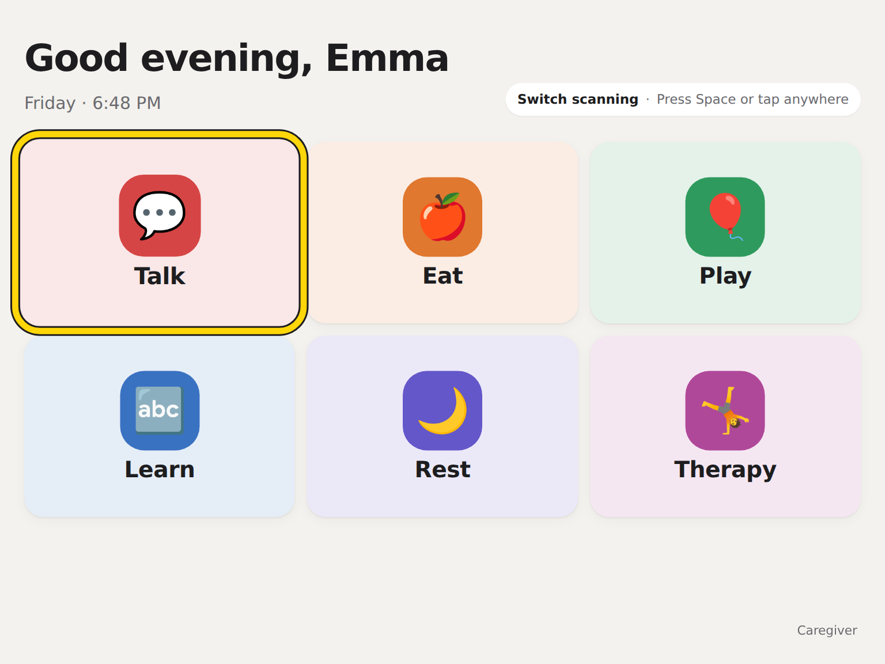
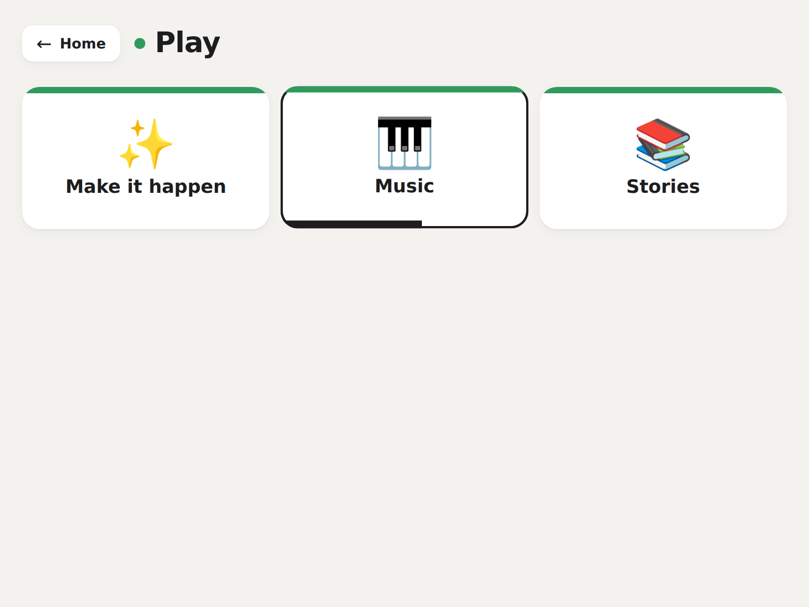
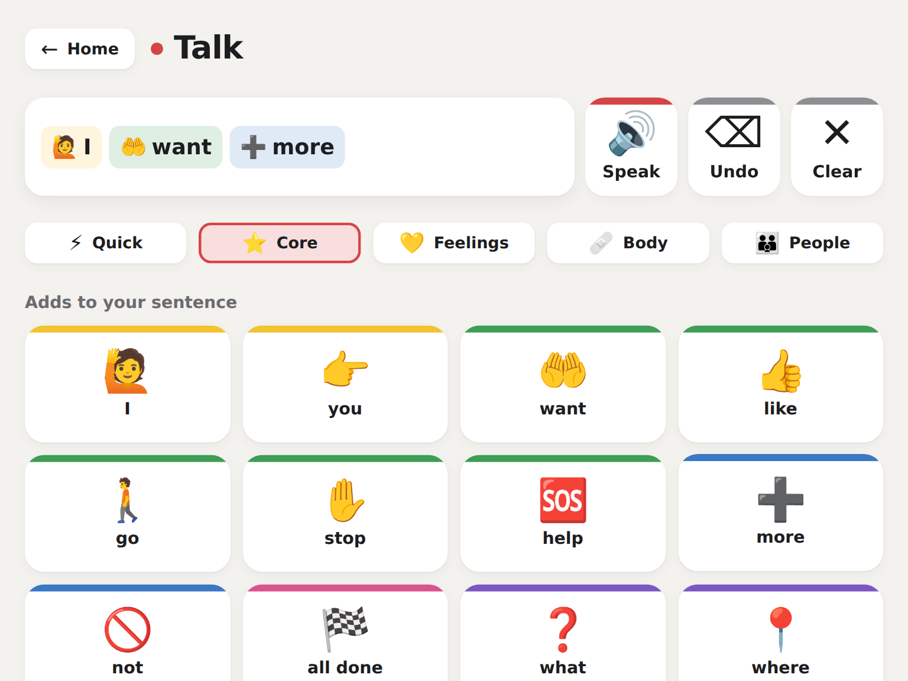
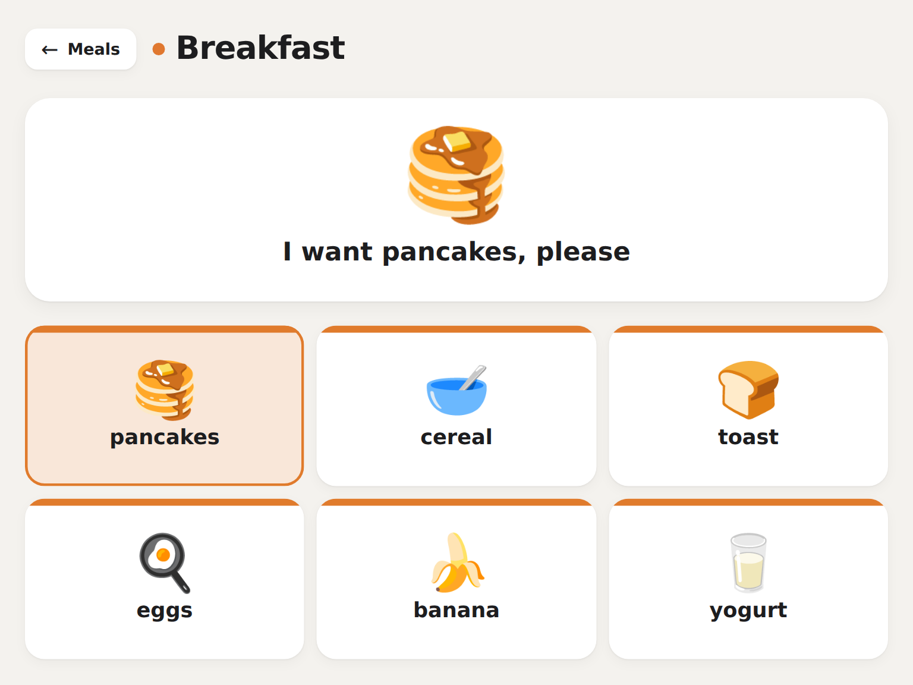
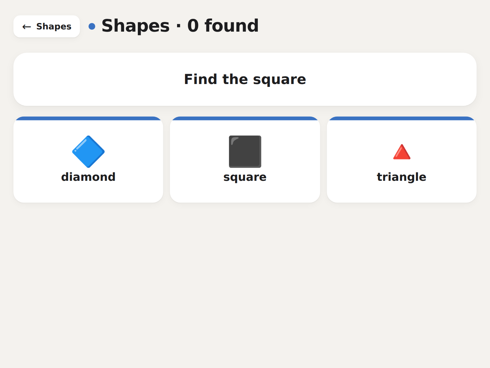
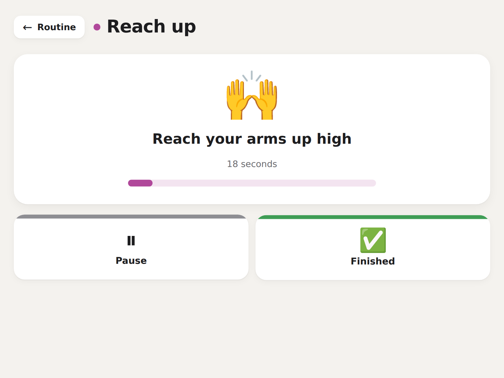
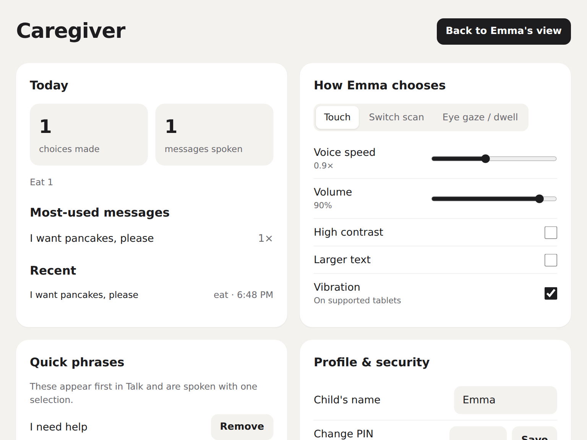

# NEXUS

**One activity-based interface for children with cerebral palsy, usable by touch, a single switch, or eye gaze.**

### [▶ Try the live demo](https://pawar17.github.io/Nexus/)

On first load, pick how the child chooses. To feel what a switch user experiences, pick **Switch scanning** and press **Space**, or tap anywhere, when the tile you want lights up. Caregiver settings are at the bottom right (demo PIN `1234`).



---

## The problem

Children with quadriplegic cerebral palsy often can't use a touchscreen reliably. They select with a **single switch** (a large button pressed with the head, hand or knee) or with **eye gaze**. Their day is also split across several separate assistive technology (AT) systems: one for communication, others for learning, play and therapy. Each has its own layout and its own setup.

For the child, every switch between tools costs effort and independence. For families and clinicians, it means configuring and maintaining many systems instead of one.

## What we learned from users

We interviewed clinicians and families to map a child's actual day. Three insights shaped the product:

1. **Children think in activities, not apps.** Talking, eating, playing and resting is how families described the day, so that is how NEXUS is organized.
2. **Access method comes first.** If an interface isn't built for switch and gaze users from the start, the children who need it most can't use it at all.
3. **Caregivers need control without complexity.** They set things up and need to see what's working, but the child's screen must stay uncluttered.

## Impact

In testing, NEXUS **raised functional task independence from 10% to 80%** for children with quadriplegic cerebral palsy: tasks they could complete without an adult stepping in.

## What it does

### Three ways to choose, on every screen

| Input | How it works |
|---|---|
| **Touch** | Tap a tile |
| **Switch scanning** | Tiles light up one at a time with a high-visibility yellow and black ring. A switch press selects the lit tile. Space, Enter or a tap anywhere all count, so switch interfaces that send a key press work out of the box. Scan speed is adjustable |
| **Eye gaze / dwell** | Resting the pointer on a tile fills a progress bar, then selects it. Eye trackers and head pointers drive the pointer, so this is how gaze users select. Dwell time is adjustable to prevent accidental picks |



### Six activities

| Activity | What the child can do |
|---|---|
| **Talk** | Speak quick phrases in one selection, or build sentences from core words, feelings, body and people boards. Tiles follow the **Fitzgerald Key** color code speech therapists use on paper AAC boards |
| **Eat** | Say what they need at the table ("too hot", "more please") and choose food and drinks |
| **Play** | Cause-and-effect games with sound, a music maker and read-aloud stories |
| **Learn** | Explore colors, shapes, numbers and animals, then play a spoken "find it" game |
| **Rest** | Guided breathing, calming sound, bedtime stories, and "I need a break" messages |
| **Therapy** | A daily routine with spoken steps and timers, plus progress across the week |

| Talk: building a sentence | Eat: choosing breakfast |
|---|---|
|  |  |
| **Learn: find-it game** | **Therapy: guided exercise** |
|  |  |

### Caregiver mode

A PIN-protected panel, kept off the child's scan path, where caregivers:

- set the input method, scan speed, dwell time, voice speed, volume, high contrast and larger text
- add or remove the child's quick phrases
- see today's choices, messages spoken, most-used messages and a recent activity log



## Design decisions

- **Every target is scannable by default.** Any element marked `data-target` joins switch scanning and dwell automatically ([`AccessLayer.tsx`](src/access/AccessLayer.tsx)), so new screens can't accidentally leave switch users out.
- **Fitzgerald Key colors.** People are yellow, actions green, describing words blue, things orange, social pink, questions purple. Children who already use paper AAC boards recognize the layout.
- **Calm, consistent visuals.** One system font, a neutral base, one accent per activity, and large targets with symbol plus label. Nothing competes with the scan highlight.
- **Voice on every action.** Uses the browser's Web Speech API, so it runs on any tablet with no install. Voice speed and volume are per child.
- **Private by default.** Settings, phrases and the activity log stay on the device.

## Roadmap

- Row-column scanning for faster selection on large boards
- Two-switch mode (one switch to move, one to select)
- Caregiver-uploaded photos as symbols (family members, favorite foods)
- Therapist view that shares progress across devices

## Tech stack

React · TypeScript · Vite · Tailwind CSS · Web Speech API · Web Audio API · published to GitHub Pages by a GitHub Actions workflow

## Run locally

```bash
npm install
npm run dev        # http://localhost:8080
```

---

Built by [Aadya Pawar](https://aadyapawar.com/) · [LinkedIn](https://www.linkedin.com/in/aadyapawar/)
