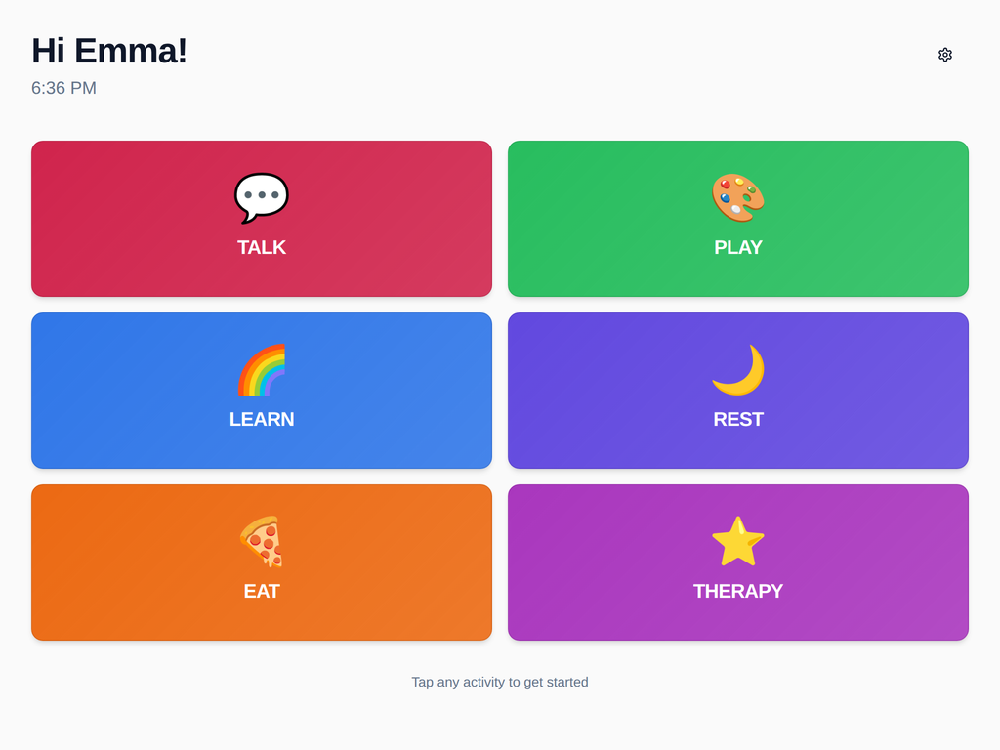
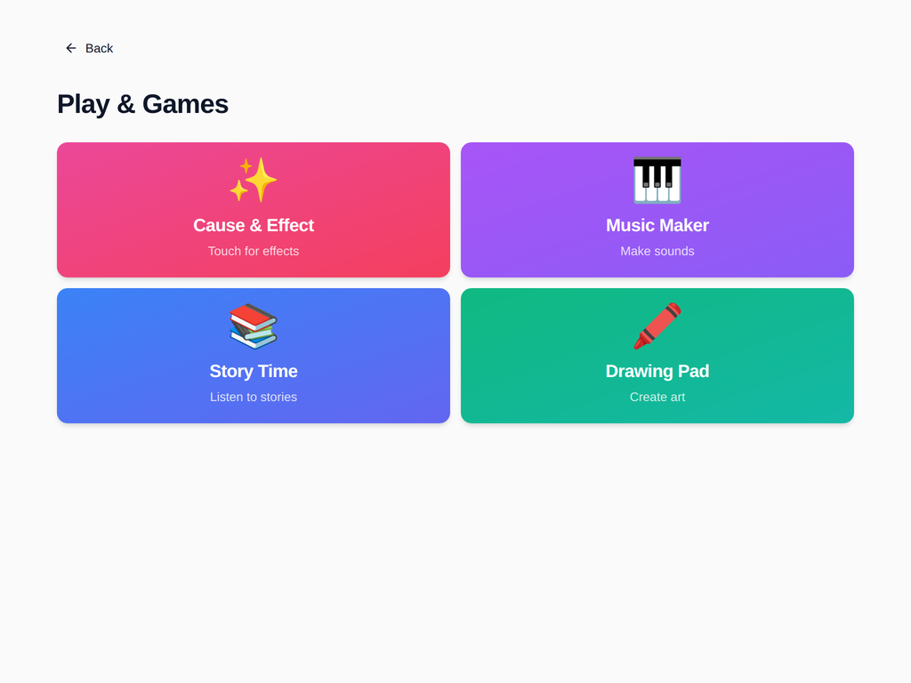
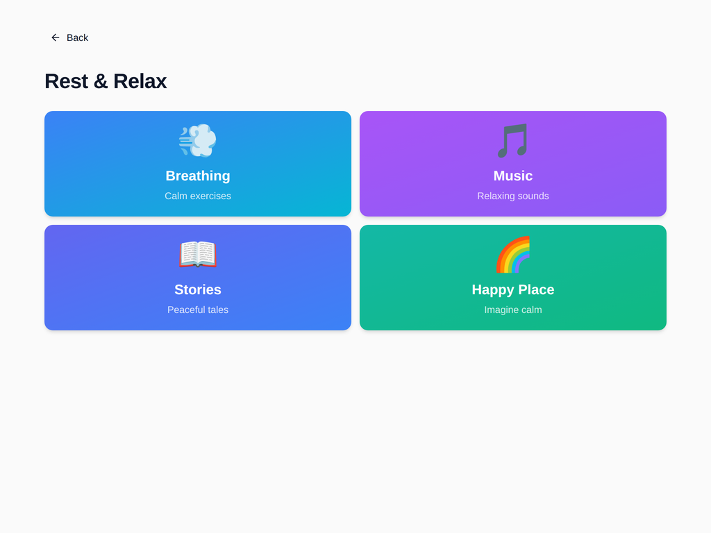

# NEXUS

**One activity-based interface for children with cerebral palsy, in place of a patchwork of assistive tools.**

### [▶ Try the live demo](https://pawar17.github.io/Nexus/)

Works in any browser and is best on a tablet. Tap **TALK** and press a message to hear it spoken aloud.



---

## The problem

Children with quadriplegic cerebral palsy often rely on several separate assistive technology (AT) systems: one to communicate, others for learning, therapy and play. Each has its own layout, its own controls and its own setup. For a child with limited motor control, every switch between tools is a barrier. For families and clinicians, it means configuring and maintaining many systems instead of one.

## What we learned from users

We interviewed clinicians and families to map a child's actual day. The main insight was that **children don't think in "apps," they think in activities**: talking, playing, eating, resting. The fragmentation between tools, not any single tool, was the biggest obstacle to independence.

## The solution

NEXUS organizes everything around six daily activities, each one tap from home, with large high-contrast targets and spoken feedback throughout.

| Activity | What the child can do |
|---|---|
| 💬 **Talk** | Tap quick messages ("I need help", "Yes", "No"), browse Feel / Want / Hurt / Play phrases, or build sentences word by word. Everything is spoken aloud |
| 🎨 **Play** | Cause-and-effect games, a music maker, read-aloud stories and a drawing pad |
| 🌈 **Learn** | Colors, shapes, numbers and letters with audio |
| 🌙 **Rest** | Guided breathing, calm music, bedtime stories and a "happy place" visualization |
| 🍕 **Eat** | Choose meals and say what they need at mealtime |
| ⭐ **Therapy** | Guided exercises and stretches, therapy games and progress tracking |

A **Settings** screen lets caregivers adjust text size, audio volume, haptic feedback and animations.

## Impact

In testing, NEXUS **raised functional task independence from 10% to 80%** for children with quadriplegic cerebral palsy: tasks they could complete without an adult stepping in.

## Screenshots

| Talk | Play |
|---|---|
|  |  |
| **Therapy** | **Rest** |
|  |  |

## Design decisions

- **Activities instead of apps.** This mirrors how families described their child's day, and cuts every task to one or two taps from home.
- **Large targets, color plus emoji plus label.** Each choice is recognizable three ways, which supports children who can't yet read and those with visual or motor limits.
- **Voice output on every action.** Built on the browser's Web Speech API, so it works on any tablet with no install.
- **Caregiver controls in one place.** Settings are saved on the device, so a child's setup carries between sessions.

## Roadmap

- Voice commands and eye-gaze input (the toggles are already in Settings; the input methods are next)
- Switch scanning for children who use a single switch
- Personalized vocabulary and photos set by caregivers
- Caregiver dashboard that tracks therapy progress over time

## Tech stack

React · TypeScript · Vite · Tailwind CSS · shadcn/ui · Web Speech API · deployed with GitHub Actions to GitHub Pages

## Run locally

```bash
npm install
npm run dev        # http://localhost:8080
```

---

Built by [Aadya Pawar](https://aadyapawar.com/) · [LinkedIn](https://www.linkedin.com/in/aadyapawar/)
